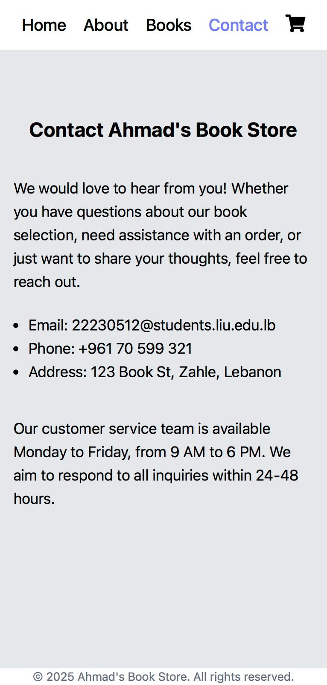

# Ahmad Book Store

A full-stack e-commerce web application for an online bookstore, featuring book browsing, shopping cart, order management, and admin panel.

## 🚀 Features

### Customer Features
- **Book Browsing**: Browse books by category (Romance, Fantasy, Mystery, Historical)
- **Search & Filter**: Search books by title or author
- **Shopping Cart**: Add books to cart with quantity management
- **Checkout**: Complete orders with customer details
- **Responsive Design**: Modern UI built with Tailwind CSS

### Admin Features
- **Authentication**: Secure admin login
- **Book Management**: Add, edit, and delete books
- **Order Management**: View all customer orders
- **Dashboard**: Admin panel for store management

## 🛠 Tech Stack

### Frontend
- **React 19** - Modern React with hooks
- **Vite** - Fast build tool and dev server
- **Tailwind CSS** - Utility-first CSS framework
- **React Router v7** - Client-side routing

### Backend
- **Node.js** - JavaScript runtime
- **Express.js** - Web framework
- **MySQL** - Database
- **JWT** - Authentication (session-based)

### Deployment
- **Railway** - Cloud platform for hosting
- **GitHub** - Version control

## 📁 Project Structure

```
ahmad-book-store/
├── back/                    # Backend (Node.js/Express)
│   ├── server.js           # Main server file
│   ├── db.js              # Database connection
│   ├── package.json       # Backend dependencies
│   └── .env               # Environment variables
├── client/                 # Frontend (React/Vite)
│   ├── src/
│   │   ├── components/    # React components
│   │   │   ├── Admin.jsx      # Admin dashboard
│   │   │   ├── Books.jsx      # Books catalog
│   │   │   ├── Header.jsx     # Navigation header
│   │   │   ├── ShoppingCart.jsx # Cart page
│   │   │   └── ...
│   │   ├── App.jsx        # Main app component
│   │   └── main.jsx       # App entry point
│   ├── public/            # Static assets
│   └── package.json       # Frontend dependencies
└── README.md
```

## 🗄 Database Schema

### Books Table
- `id` (Primary Key)
- `title` (Book title)
- `author` (Author name)
- `price` (Book price)
- `category` (Romance/Fantasy/Mystery/Historical)
- `imgSrc` (Image URL)
- `description` (Book description)

### Orders Table
- `id` (Primary Key)
- `customer_name`
- `customer_email`
- `customer_address`
- `customer_mobile`
- `ordered_books` (JSON array)
- `total_amount`
- `order_date`

### Users Table
- `id` (Primary Key)
- `username`
- `password` (Admin credentials)

## 🚀 Getting Started

### Prerequisites
- Node.js 18+
- npm or yarn
- MySQL database (local or Railway)

### Installation

1. **Clone the repository**
   ```bash
   git clone https://github.com/ahmad-dev-code/ahmad-book-store.git
   cd ahmad-book-store
   ```

2. **Setup Backend**
   ```bash
   cd back
   npm install
   
   # Set up MySQL database
   # Create a database named 'bookstore'
   # Update .env file with your MySQL credentials
   
   # Run the server
   npm start
   
   # For development with auto-restart
   npm run dev
   ```

3. **Setup Frontend** (in new terminal)
   ```bash
   cd client
   npm install
   npm run dev
   ```

4. **Access the application**
   - Frontend: http://localhost:5173
   - Backend: http://localhost:5000

## 🔐 Admin Access

- **Username**: admin
- **Password**: abc123
- **Admin URL**: http://localhost:5173/admin

## 📡 API Endpoints

### Authentication
- `POST /api/login` - Admin login

### Books
- `GET /api/books` - Get all books
- `GET /api/books/:id` - Get book by ID
- `POST /api/books` - Create new book (admin)
- `PUT /api/books/:id` - Update book (admin)
- `DELETE /api/books/:id` - Delete book (admin)

### Orders
- `POST /api/orders` - Create new order
- `GET /api/orders` - Get all orders (admin)

## 🚢 Deployment

### Railway Deployment

1. **Create Railway Account**
   - Sign up at https://railway.app

2. **Create Project**
   - New project → Add MySQL database
   - Note the DATABASE_URL

3. **Deploy Application**
   - Connect GitHub repository
   - Railway auto-detects Node.js apps
   - Set environment variables in Railway dashboard

4. **Environment Variables**
   - `DATABASE_URL` - Provided by Railway MySQL
   - `PORT` - Auto-set by Railway

## 📱 Usage

### For Customers
1. Browse books by category or search
2. Add books to cart
3. Proceed to checkout
4. Fill customer details and place order

### For Admins
1. Login with admin credentials
2. Manage books (add/edit/delete)
3. View all customer orders
4. Monitor store performance

## 📸 Screenshots

### Home Screen


### About Page


### Books Grid


### Contact Page


### Shopping Cart


## 🤝 Contributing

1. Fork the repository
2. Create feature branch (`git checkout -b feature/AmazingFeature`)
3. Commit changes (`git commit -m 'Add AmazingFeature'`)
4. Push to branch (`git push origin feature/AmazingFeature`)
5. Open Pull Request

## 📄 License

This project is licensed under the MIT License - see the LICENSE file for details.

## 👨‍💻 Author

**Ahmad** - [GitHub](https://github.com/ahmad-dev-code)

## 🙏 Acknowledgments

- React and Vite communities
- Tailwind CSS for styling
- Railway for hosting
- MySQL for database
